<p align="center">
  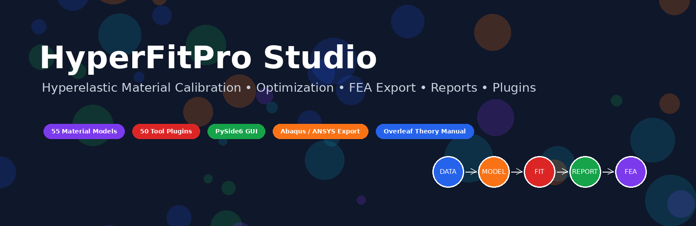
</p>

<h1 align="center">HyperFitPro Studio</h1>

<p align="center">
  <b>Hyperelastic Material Calibration • Optimization • FEA Export • Reports • Plugin Workbench</b>
</p>

<p align="center">
  
  
  
  
  
  
</p>

---

## Overview

**HyperFitPro Studio** is a Python-based desktop engineering workbench for **hyperelastic material model calibration**.

It connects experimental test data, constitutive model selection, nonlinear parameter optimization, diagnostic plotting, engineering reporting, and FEA material-card export in a single guided workflow.

The goal is to make hyperelastic calibration more **transparent**, **traceable**, and **engineering-oriented**.

---

## System Workflow

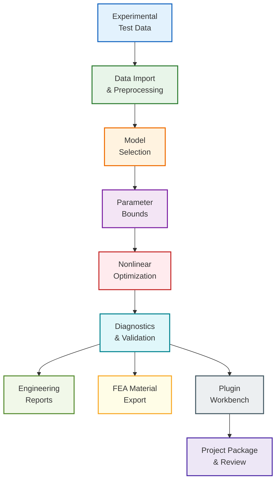

---

## Visual Preview

<p align="center">
  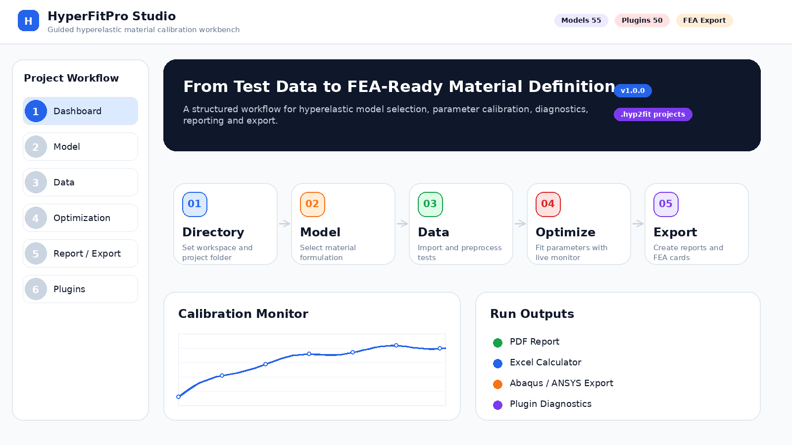
</p>

<p align="center">
  <i>FIG-01 — Guided dashboard and project workflow overview.</i>
</p>

---

## Core Capabilities

| Area | Capability |
|---|---|
| **Material Models** | 42 built-in hyperelastic models and 13 embedded model plugins |
| **Test Modes** | Uniaxial, biaxial, planar, simple shear and volumetric workflows |
| **Data Processing** | Force-displacement conversion, unit conversion, smoothing and filtering |
| **Optimization** | Local, global, hybrid, adaptive-bound and regularized fitting |
| **Diagnostics** | Residuals, stability checks, parameter traces and live iteration plots |
| **Reports** | PDF, HTML, Excel calculator and equation-based engineering reports |
| **FEA Export** | Abaqus, ANSYS, CalculiX and solver-oriented coefficient packages |
| **Plugins** | 50 embedded tool plugins for diagnostics, plotting, audit and packaging |
| **Projects** | `.hyp2fit` project files, project library and run-folder management |
| **GUI** | Modern multilingual desktop interface |

---

## Program Architecture

```mermaid
flowchart TB
    ROOT["HyperFitPro<br/>Studio"]

    ROOT --> W1["Project<br/>Workflow"]
    ROOT --> W2["Model<br/>Library"]
    ROOT --> W3["Optimization<br/>Engine"]
    ROOT --> W4["Reporting<br/>& Export"]
    ROOT --> W5["Plugin<br/>System"]

    W1 --> A1[".hyp2fit<br/>Projects"]
    W1 --> A2["Working<br/>Directory"]
    W1 --> A3["Run<br/>History"]

    W2 --> B1["42 Built-in<br/>Models"]
    W2 --> B2["13 Model<br/>Plugins"]
    W2 --> B3["Parameter<br/>Bounds"]
    W2 --> B4["Theory<br/>Manual"]

    W3 --> C1["Local<br/>Methods"]
    W3 --> C2["Global<br/>Methods"]
    W3 --> C3["Adaptive<br/>Bounds"]
    W3 --> C4["Live<br/>Iteration"]

    W4 --> D1["PDF / HTML<br/>Reports"]
    W4 --> D2["Excel<br/>Calculator"]
    W4 --> D3["Abaqus / ANSYS<br/>Export"]
    W4 --> D4["Verification<br/>Targets"]

    W5 --> E1["Diagnostic<br/>Plugins"]
    W5 --> E2["Plotting<br/>Plugins"]
    W5 --> E3["FEA Audit<br/>Plugins"]
    W5 --> E4["Package<br/>Builder"]

    style ROOT fill:#263238,stroke:#000,color:#fff,stroke-width:3px

    style W1 fill:#E3F2FD,stroke:#1565C0,stroke-width:2px
    style W2 fill:#FFF3E0,stroke:#EF6C00,stroke-width:2px
    style W3 fill:#FFEBEE,stroke:#C62828,stroke-width:2px
    style W4 fill:#E8F5E9,stroke:#2E7D32,stroke-width:2px
    style W5 fill:#F3E5F5,stroke:#7B1FA2,stroke-width:2px
```

---

## Model Library

<p align="center">
  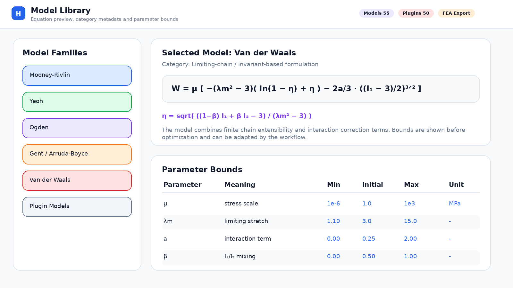
</p>

<p align="center">
  <i>FIG-02 — Model selection, equation preview and model-specific parameter bounds.</i>
</p>

HyperFitPro Studio includes invariant-based, principal-stretch-based, polynomial, exponential, limiting-chain and extended engineering formulations.

| Model Family | Examples |
|---|---|
| **Polynomial / Reduced Polynomial** | Mooney-Rivlin, Yeoh, Polynomial |
| **Principal Stretch Based** | Ogden, Bechir-type models |
| **Limiting Chain** | Gent, Arruda-Boyce, Van der Waals |
| **Exponential** | Fung, Demiray, Humphrey-Yin, Veronda-Westmann |
| **Engineering Extensions** | Hart-Smith, Horgan-Saccomandi, Hoss-Marczak |
| **Embedded Plugins** | Additional experimental and extended model forms |

---

## Data Import and Preprocessing

<p align="center">
  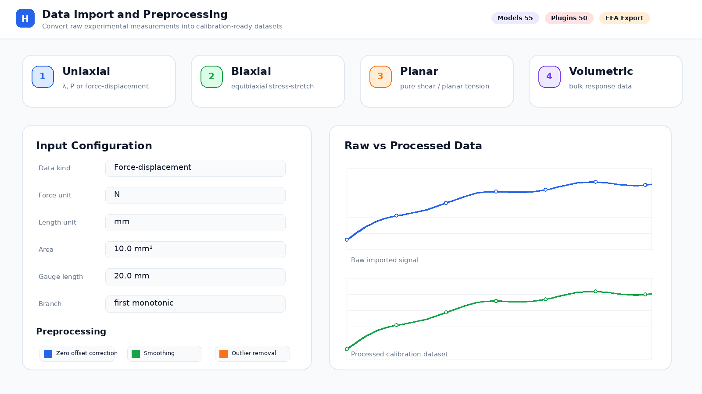
</p>

<p align="center">
  <i>FIG-03 — Experimental data import, unit conversion and preprocessing options.</i>
</p>

Supported data workflows:

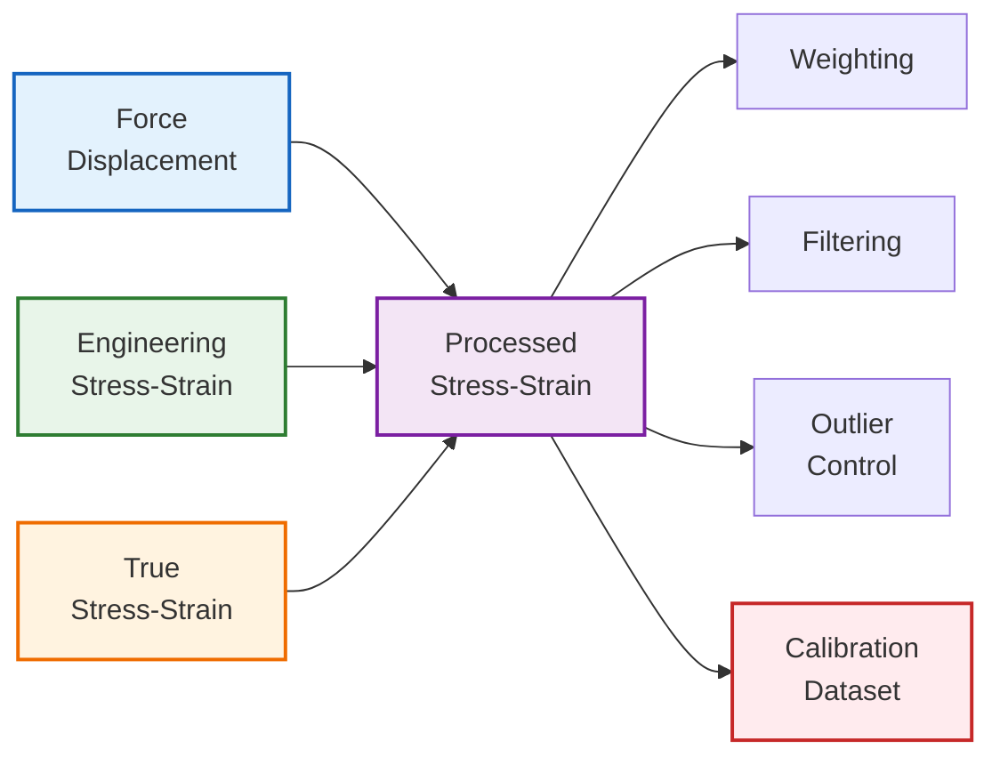

---

## Optimization and Live Monitoring

<p align="center">
  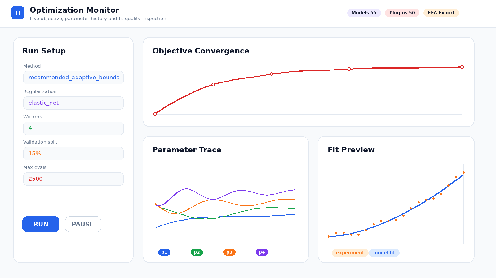
</p>

<p align="center">
  <i>FIG-04 — Live optimization monitoring with objective history, parameter trends and fit preview.</i>
</p>

The optimization engine supports:

- bounded nonlinear least-squares,
- global search,
- multi-start workflows,
- adaptive bounds,
- regularization,
- validation split,
- confidence interval estimation,
- parameter correlation analysis,
- stop / pause / resume controls,
- run-level traceability.

---

## Plugin Workbench

<p align="center">
  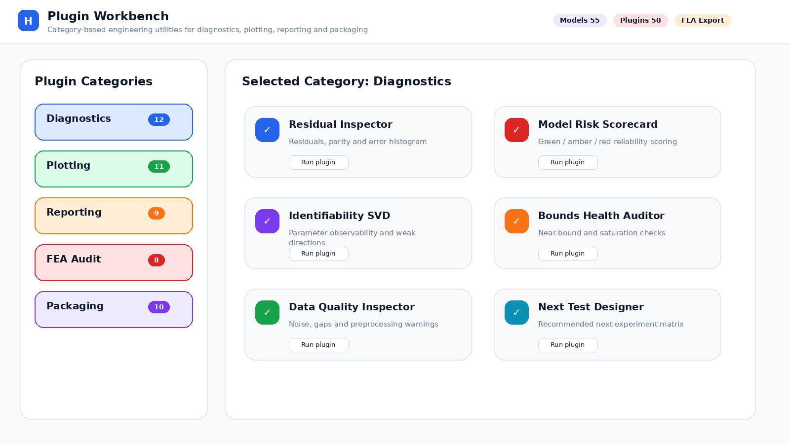
</p>

<p align="center">
  <i>FIG-05 — Category-based plugin workbench for diagnostics, plotting, reporting and export checks.</i>
</p>

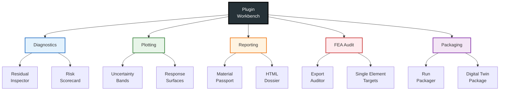

---

## Reports and FEA Export

<p align="center">
  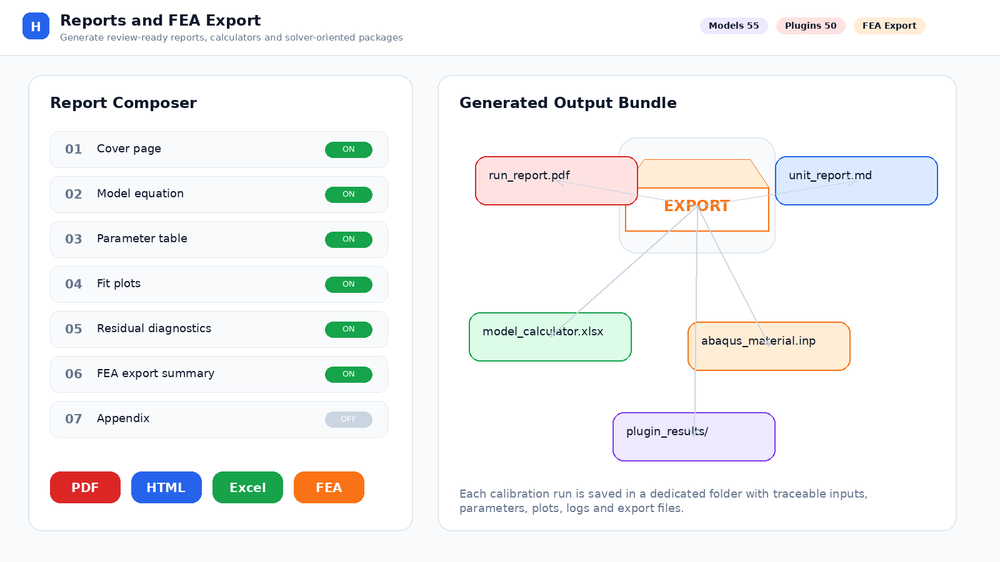
</p>

<p align="center">
  <i>FIG-06 — Report generation, Excel calculator creation and FEA export package.</i>
</p>

Generated outputs may include:

| Output | Description |
|---|---|
| **PDF Report** | Engineering summary, parameters, plots and diagnostics |
| **HTML Report** | Browser-readable interactive report |
| **Excel Calculator** | Model-specific parameter calculator and prediction sheet |
| **Abaqus Export** | Material include file and verification targets |
| **ANSYS Export** | APDL material macro package |
| **CalculiX Export** | Solver-compatible include file |
| **Audit Files** | Unit consistency and export verification summaries |

---

## Worked Examples

| ID | Example | Purpose |
|---|---|---|
| **EX-01** | Neo-Hookean quick calibration | Basic sanity check and first workflow |
| **EX-02** | Mooney-Rivlin multi-mode fit | Combined uniaxial, biaxial and planar fitting |
| **EX-03** | Yeoh force-displacement workflow | Geometry-based force-displacement conversion |
| **EX-04** | Ogden high-strain optimization | Global search and high-strain response fitting |
| **EX-05** | Gent / Van der Waals export check | Limiting-chain model and FEA export verification |

Example files are located under:

```text
sample_data/
sample_data/worked_examples/
```

---

## Installation

```bash
git clone https://github.com/nabuketsezar/HyperFitPro-Studio.git
cd HyperFitPro-Studio
python -m pip install -r requirements.txt
python run_hyperfit_pro.py
```

Alternative:

```bash
python -m hyperfitpro
```

Recommended conda environment:

```bash
conda create -n hyperfitpro python=3.12 -y
conda activate hyperfitpro
python -m pip install -r requirements.txt
python run_hyperfit_pro.py
```

---

## Verification

```bash
python -m pytest -q
python scripts/dev_check.py --fast
```

Verification modules cover:

- model library integrity,
- mechanical response kernel,
- data processing,
- optimization workflow,
- FEA export,
- plugin loading,
- project architecture.

---

## Documentation

| Document | Location |
|---|---|
| User Guide | `docs/help/HyperFitPro_User_Guide.pdf` |
| HTML Guide | `docs/help/HyperFitPro_User_Guide.html` |
| Theory Manual | `docs/theory/HyperFitPro_Hyperelastic_Theory_Manual` |
| Plugin Guide | `docs/PLUGIN_AUTHORING_GUIDE.md` |
| Validation Notes | `docs/VALIDATION_NOTES.md` |

---

## Author

**Erdem Uyunmaz, MSc**  
Mechanical Engineer / Stress & Structural Analysis Engineer

Focus areas:

- finite element analysis,
- aircraft structures,
- structural mechanics,
- material modeling,
- constitutive modeling,
- engineering software development,
- Python-based simulation tools.

---

## Disclaimer

HyperFitPro Studio is an engineering software framework under active development.  
Generated material parameters and FEA export files should be independently reviewed and validated before production-level engineering use.
